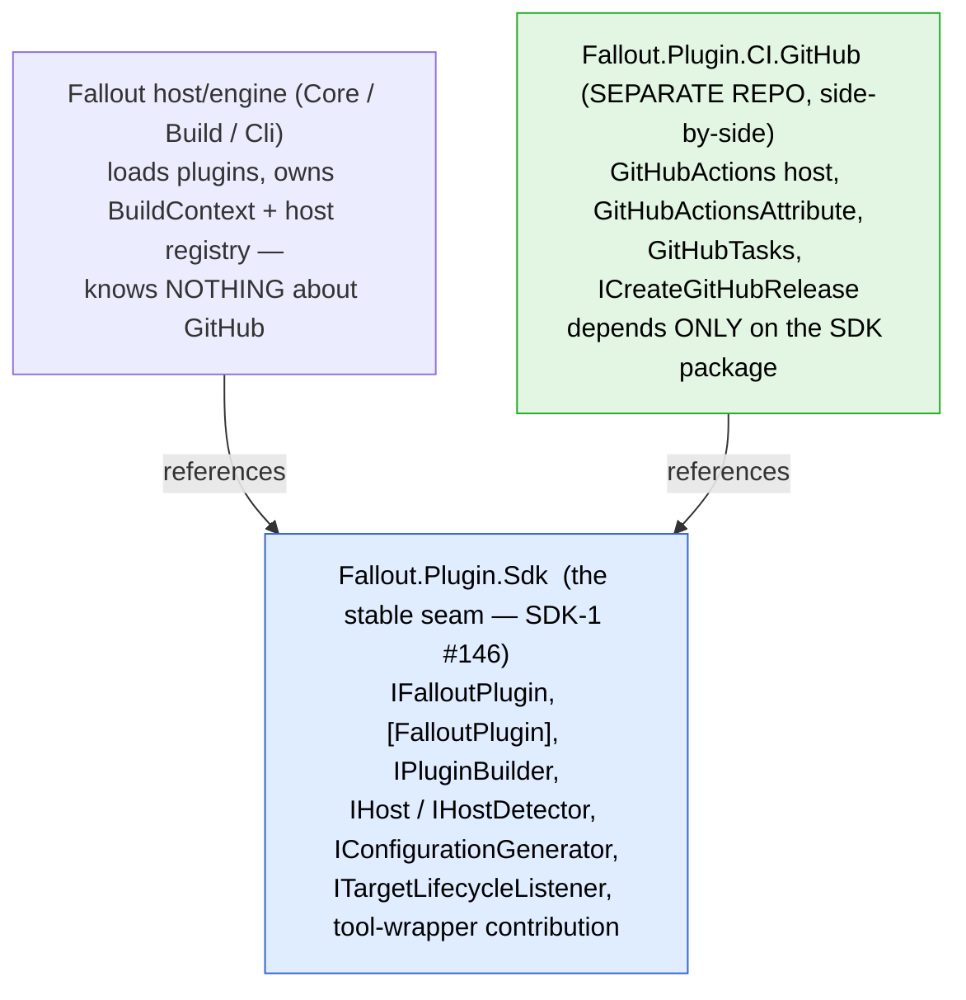
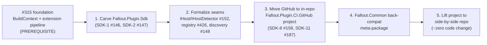

# Plugin extraction — GitHub as the worked example

> How a first-party CI provider (GitHub) becomes a side-by-side plugin package, and what has to change in the engine first.
> This is the concrete companion to the SDK ticket set ([milestone #7](https://github.com/Fallout-build/Fallout/milestone/7)) and the foundation epic [#315](https://github.com/Fallout-build/Fallout/issues/315). It picks GitHub as the canonical case because it is the most complex first-party integration and is named as the dogfood proof in [#187 (SDK-11)](https://github.com/Fallout-build/Fallout/issues/187).
> For the engine-internals rationale this depends on, see [engine-de-statification.md](engine-de-statification.md). For repo layout, see [architecture.md](architecture.md).

## TL;DR

The seams a plugin model needs **mostly already exist** — `Host` / `IBuildServer` / `ConfigurationAttributeBase` / the `IBuildExtension` listeners are real abstraction points. Extracting GitHub is therefore not "invent a plugin system"; it is three concrete moves:

1. **Carve a stable contract package** (`Fallout.Plugin.Sdk`, [#146](https://github.com/Fallout-build/Fallout/issues/146)) out of `Fallout.Build` / `Fallout.Components` so a plugin can reference *that* downward instead of the kitchen-sink `Fallout.Common`.
2. **Formalize three reflection-by-convention seams** (host detection, ambient singleton resolution, the per-provider config attribute) into explicit registration through a per-run context.
3. **Move GitHub out of `Fallout.Common` into its own package** — first in-repo (dogfood), then physically side-by-side once the SDK is public.

The hard prerequisite is **not** GitHub-specific: it is the de-statification epic ([#315](https://github.com/Fallout-build/Fallout/issues/315)). Plugin activation has to flow through the internal `BuildContext`, not the `Host.Instance` process global, or reentrancy / multiple plugins / test isolation all break.

**VCS is not symmetric with CI** — see the caveat below. CI is plugin-ready-ish; VCS needs an abstraction invented first.

## What "the GitHub plugin" actually is

GitHub is not one type — it is a **bundle of contributions across five extension points**, today scattered across three assemblies:

| Contribution | Today (path / namespace) | Extension point |
|---|---|---|
| `GitHubActions : Host, IBuildServer` | `src/Fallout.Common/CI/GitHubActions/` · `Fallout.Common.CI.GitHubActions` | **CI host** — detection + branch/commit metadata |
| `GitHubActionsAttribute : ConfigurationAttributeBase` | same dir | **Config generator** — emits workflow YAML |
| `GitHubTasks` (Octokit, hand-written) | `src/Fallout.Common/Tools/GitHub/GitHubTasks.cs` · `Fallout.Common.Tools.GitHub` | **Tool wrapper** — API client |
| `ICreateGitHubRelease` | `src/Fallout.Components/ICreateGitHubRelease.cs` · `Fallout.Components` | **Component** — reusable build pattern |
| `GitHubActions.Theming` | same CI dir | **Output sink / theme** |

A plugin package gathers all five behind one declaration. That maps almost 1:1 onto the extension-point catalogue already scoped in SDK-6a..6f ([#151](https://github.com/Fallout-build/Fallout/issues/151)–[#156](https://github.com/Fallout-build/Fallout/issues/156)): build middleware, **CI host adapters** (`IHost`/`IHostDetector`, [#152](https://github.com/Fallout-build/Fallout/issues/152)), parameter sources, tool-wrapper contributions, **lifecycle listeners** (`ITargetLifecycleListener`, [#155](https://github.com/Fallout-build/Fallout/issues/155)), output sinks.

## Dependency direction is the whole game

A side-by-side GitHub repo only works if it references a **small, stable contract package downward**, and core never references GitHub upward.



The engine depends on the SDK; the plugin depends on the SDK; **neither depends on the other.** That bidirectional independence is what lets the GitHub repo live next door and ship on its own cadence (additive-only SDK minors, per [RFC #3 / #99](https://github.com/Fallout-build/Fallout/issues/99)).

Today the equivalent edge is `Fallout.Common` → everything, and consumers reference `Common` and get *every* provider whether they use it or not. The plugin model inverts this to opt-in.

## What a plugin looks like in code

```csharp
// In the side-by-side Fallout-build/Fallout-plugin-ci-github repo:
[assembly: FalloutPlugin(typeof(GitHubPlugin))]

public sealed class GitHubPlugin : IFalloutPlugin
{
    public void Configure(IPluginBuilder builder)
    {
        builder.AddCIHost<GitHubActionsHost>();                 // IHost + IHostDetector
        builder.AddConfigurationGenerator<GitHubActionsAttribute>();
        builder.AddComponent<ICreateGitHubRelease>();
        builder.AddTools(GitHubTasks.Catalogue);
        builder.AddTheme(GitHubActionsTheme.Instance);
    }
}
```

Same convention as Roslyn analyzers / MSBuild SDKs / source generators — the shape committed in [RFC #1 / #97](https://github.com/Fallout-build/Fallout/issues/97) and SDK-2 ([#147](https://github.com/Fallout-build/Fallout/issues/147)). The consumer just `<PackageReference>`s the plugin in `_build.csproj`; the engine scans referenced assemblies for `[FalloutPlugin]` at startup ([#148](https://github.com/Fallout-build/Fallout/issues/148), SDK-3) and calls `Configure`.

## Three seams to formalize (the real work)

| # | Seam | Today | Target | Existing ticket |
|---|---|---|---|---|
| 1 | **Host detection** | `AppDomain` scan for `Host` subclasses, each exposing a magic-named `IsRunningGitHubActions` static property, `Activator.CreateInstance(…, nonPublic: true)` | Explicit registration into a typed host registry; detection as a real interface method `IHostDetector.IsActive(env)` | SDK-6a `IHost`/`IHostDetector` ([#152](https://github.com/Fallout-build/Fallout/issues/152)); typed registry refactor (#426) |
| 2 | **Ambient singleton → context** | `GitRepository.GetBranchFromCI()` reaches `Host.Instance as IBuildServer`; `Host.Default` is a process global | Plugin host instance resolved from the per-run `BuildContext` | FT-2 ([#307](https://github.com/Fallout-build/Fallout/issues/307)), FT-3 ([#308](https://github.com/Fallout-build/Fallout/issues/308)) |
| 3 | **Per-provider config attribute** | `[GitHubActions]` on the consumer's build class, discovered by reflection at build-tool execution | Unchanged mechanism, but the attribute type ships from the plugin package | SDK-6 config-generator point |

Seam 1 is the one that most blocks *external* assemblies: reflection-by-convention across a package boundary you don't control is fragile. Seam 2 is why #315 is a hard prerequisite, not a nice-to-have.

Note: config generation runs via **reflection at build-tool execution time**, not Roslyn source generation, so a config attribute crossing the package boundary carries **no analyzer-packaging burden**. Low risk — worth a confirming test, not a redesign.

## VCS is not symmetric with CI

The ask is "VCS *and* CI as plugins." They are at very different maturity:

- **CI is plugin-ready-ish** — `Host` / `IBuildServer` / `ConfigurationAttributeBase` are genuine abstraction points already.
- **VCS is not** — there is only a concrete, git-only `GitRepository` (`src/Fallout.Build/VCS/GitRepository.cs`, namespace `Fallout.Common.Git`), with **no `IVcs` interface**. Its only CI seam is `Host.Instance as IBuildServer` for branch/commit. Making VCS pluggable means *inventing* an `IVcsProvider` abstraction that does not exist today.

**Recommendation:** prove the model on GitHub-CI first; treat pluggable VCS as a later, separate lift gated on a new abstraction.

## Staged extraction path

Steps 1–4 happen **in this repo** before anything goes side-by-side. Every step is independently shippable and carries value even if the physical split never happens.



1. **Carve `Fallout.Plugin.Sdk`** out of `Fallout.Build` / `Components` — only the contract surface GitHub touches. No behavior change.
2. **Replace the reflection seams** with explicit registration + typed host registry.
3. **Move GitHub into an in-repo `Fallout.Plugin.CI.GitHub` project** — separate package, same solution. Dogfood it as *this build's own* CI provider. This is SDK-11 ([#187](https://github.com/Fallout-build/Fallout/issues/187)) using GitHub as the worked example, and overlaps the canonical reference plugin (SDK-8, [#158](https://github.com/Fallout-build/Fallout/issues/158)).
4. **Add a `Fallout.Common` back-compat meta-package** that transitively depends on the first-party plugins, so existing consumers keep the "reference one thing, get GitHub" experience.
5. **Lift the in-repo project to a side-by-side repo** — by now it depends only on the published SDK package, so the physical move is ~zero code change. Gated on the SDK going public (milestone #7), not on #315.

## Breaking-change surface

**Decision (locked): breaking changes are acceptable on the 2026 line for this work, and we want to ship sooner rather than later.** That removes the need for transition shims on most of the moves below — we break cleanly and document the migration, rather than carrying `[Obsolete]` forwarders. Shims are now opt-in polish, not a gate.

The internal seam work (steps 1–2) is largely facade-preserving anyway. The exposed surface:

- **Splitting `Fallout.Common`** — consumers reference per-provider packages instead of the kitchen sink. A `Fallout.Common` back-compat meta-package is *optional* under decision C; we may simply break and document.
- **`ICreateGitHubRelease` moves to the plugin** (it's GitHub-specific) — a clean break; an `[Obsolete]` type-forward via `src/Shims/` + `TransitionShimGenerator` is available if we want a softer landing, but not required.
- **`GetConfiguration(IReadOnlyCollection<ExecutableTarget>)` → `… ITargetModel`** (see design sketch B) — breaking signature change on the config-gen contract; acceptable.
- **`GitRepository.GetGitHubOwner()/GetGitHubName()` move off the core `GitRepository`** into the plugin — breaking; acceptable.
- **SDK versioning lock-in is the one hard constraint** — once `Fallout.Plugin.Sdk` 1.0 ships it is additive-only forever ([RFC #3 / #99](https://github.com/Fallout-build/Fallout/issues/99)). Breaking freely is fine *now, pre-1.0, while the interfaces are `internal`/`[Experimental]`*; the freedom ends at the SDK 1.0 cut. This is why we dogfood the shapes before publishing.

## How this slots into the existing plan

This note adds no new tickets. It is the concrete reading of the existing set, with GitHub as the worked example:

- **Prereq:** #315 foundation (esp. FT-2 #307, FT-3 #308, FT-7 #312).
- **Contract:** SDK-1 #146, SDK-2 #147, SDK-3 #148.
- **Extension points exercised:** SDK-6a `IHost`/`IHostDetector` #152, SDK-6d `ITargetLifecycleListener` #155 (+ the rest of #151–#156).
- **Dogfood / proof:** SDK-8 #158, **SDK-11 #187 ← GitHub is the canonical case here.**

## Move manifest (type-by-type)

> Result of tracing every cross-assembly reference out of the 21 GitHub files. **Headline: GitHub barely depends on the `Fallout.Common` assembly proper.** The `using Fallout.Common.*` directives resolve across *four* assemblies; the only references that land in the `Fallout.Common` **assembly** are `ChangelogTasks` and the GitHub-specific `GitRepository` extensions. Everything else is contract surface (→ SDK), utilities, tooling, or the GitHub code itself.

Namespace ≠ assembly. `using Fallout.Common.*` actually resolves to:

| Namespace prefix | Owning assembly | Plugin treatment |
|---|---|---|
| `.Utilities` / `.IO` / `.Net` / `.Collections` | `Fallout.Utilities` | reference as-is (dependency-free) |
| `.Tooling` | `Fallout.Tooling` | reference as-is |
| `.CI` / `.Execution` / `.Execution.Theming` / `ConfigurationEntity` / `CustomFileWriter` / DSL attributes / `Target` | `Fallout.Build` | **contract → move to `Fallout.Plugin.Sdk`** |
| `.Execution` (`ITargetModel`, `ExecutionStatus`) | `Fallout.Core` | SDK references Core |
| `.ChangeLog` + GitHub `GitRepository` extensions | `Fallout.Common` | **the only real `Common` coupling** |

Per contribution (target buckets: **SDK** = new contract pkg · **Util/Tooling** = ref as-is · **Engine** = stays, reached via `BuildContext` facade · **Plugin** = moves into `Fallout.Plugin.CI.GitHub`):

**① CI host** (`GitHubActions.cs` / `.Client.cs` / `.Theming.cs`)

| Type | Now | → | Note |
|---|---|---|---|
| `Host` (base) | Build | **SDK** (as `IHost`, see sketch A) | plugin *implements*, doesn't inherit |
| `IBuildServer` | Build | **SDK** | clean |
| `Host.Instance` (static, line 24) | Build | **Engine** → `BuildContext` | seam #2, gated on #307/#308 |
| `IHostTheme` (Execution.Theming) | Build | **SDK** | optional capability iface |
| `EnvironmentInfo`, `AbsolutePath`, `Lazy`, `Configure<T>`, ext methods | Utilities / Tooling | ref as-is | none |
| all `GitHubActions*` members | Common | **Plugin** | move |

**② Config generator** (`GitHubActionsAttribute.cs` + `Configuration/*`)

| Type | Now | → | Note |
|---|---|---|---|
| `ConfigurationAttributeBase`, `IConfigurationGenerator` | Build | **SDK** | clean |
| `ConfigurationEntity` (base of `Configuration/*`), `CustomFileWriter` | Build | **SDK** | move |
| `ExecutableTarget` (on `GetConfiguration` sig) | Build | **SDK uses `ITargetModel`** | see sketch B |
| `Build.RootDirectory` (static) | Build | **Engine** → `BuildContext` | seam #2 |
| `Assert` | Utilities | ref as-is | none |
| `GitHubActions{Job,Step,Trigger,…}` | Common | **Plugin** | move |

**③ Tool wrapper** (`GitHubTasks.cs`) — `Octokit` + a static `GitHubClient`, only utility deps. Moves wholesale into the plugin; no contract implications. The cleanest of the four.

**④ Component** (`ICreateGitHubRelease.cs`)

| Type | Now | → | Note |
|---|---|---|---|
| `IHasGitRepository`, `IHasChangelog` | Components | **stays** (provider-agnostic) | plugin references down |
| `[Parameter]`/`[Secret]`/`[ParameterPrefix]`, `Target`, `TryGetValue` | Build | **SDK** | DSL surface |
| `GitHubActions.Instance` (line 21) | (plugin) | **Plugin** | moving the whole interface *fixes* a Components→GitHub reverse coupling |
| `GitRepository.GetGitHubOwner()/GetGitHubName()` | Common | **Plugin** | GitHub-specific helpers on the generic core `GitRepository` — breaking move (decision C) |
| `ChangelogTasks` | Common | **stays** — needs a non-`Common` home if `Common` splits | the one real `Common` dep |

## Decisions locked (deep-dive round 1)

- **A — host is implemented, not inherited.** Plugins implement an `IHost`/`IHostDetector` contract; **`Fallout.Core` has zero awareness of *how* any host detects or presents itself.** Every plugin does it differently. The heavy presentation behavior on today's `Host` (logo, target-outcome table, Serilog wiring) stays engine-side as defaults — plugins override only via opt-in capability interfaces.
- **B — config-gen reads `ITargetModel`, not `ExecutableTarget`.** The read-only projection already exists in `Fallout.Core` (`ITargetModel`, documented as the SDK-facing view). The contract switches to it now; the eventual full move of `ExecutableTarget` into Core (#88) is deferred — "lots to unpack," and *not* required to decouple the contract.
- **C — breaking changes are allowed on the 2026 line, ship sooner.** No shim gate; see *Breaking-change surface* above. The one hard line is the SDK 1.0 additive-only freeze.

## Design sketch A — host as composition (`IHost` / `IHostDetector`)

Today `Host` fuses four concerns in one ~207-LOC base class (`src/Fallout.Build/Host.cs`, `Host.Activation.cs`):

1. **Detection** — a magic `IsRunning{TypeName}` static property found by reflection (`Host.Activation.cs:29-35`), plus an `AppDomain`-wide type scan (`:23-27`) and a `TypeConverter` for `--host` string parsing.
2. **CI metadata** — `Branch`/`Commit` via the already-separate `IBuildServer`.
3. **Presentation** — `WriteLogo`, `WriteBlock`, `WriteTargetOutcome`, `WriteBuildOutcome`, `ReportError/Warning`, Serilog `LogEventSink`. Heavy, engine-coupled (`IFalloutBuild`, `ExecutionStatus`, `ExecutableTarget`).

Only (1) and (2) are things a plugin must own. (3) is engine default behavior a plugin should *not* have to reimplement. The carve splits them:

```csharp
// Fallout.Plugin.Sdk — the contract. Fallout.Core stays unaware of any concrete host.
public interface IHostDetector                 // replaces the IsRunning{Name} static + AppDomain scan
{
    int Priority { get; }                       // CI hosts outrank the Terminal fallback (replaces the OrderBy/Terminal-last logic)
    bool IsActive(IBuildEnvironment env);       // cheap env probe; env is injected, not an ambient static
    IHost Create(IBuildEnvironment env);
}

public interface IHost { string Name { get; } } // identity only — nothing about HOW

// Opt-in capability interfaces a host MAY implement (composition over a god base):
public interface IBuildServer { string Branch { get; } string Commit { get; } }   // already exists
public interface IHostOutput  { void WriteCommand(string command, string message, …); /* ::group::/::error:: */ }
public interface IHostTheme   { /* already exists in Fallout.Build/Theming */ }
```

`IBuildEnvironment` is a thin seam over `EnvironmentInfo` env-var reads — makes detection testable and removes the ambient-static dependency (it also retires the `IsRunning{Name}` naming convention and the `Activator.CreateInstance(nonPublic:true)` reflection). GitHub reshapes to:

```csharp
// In the plugin:
public sealed class GitHubActionsDetector : IHostDetector
{
    public int Priority => HostPriority.ContinuousIntegration;
    public bool IsActive(IBuildEnvironment env) => env.HasVariable("GITHUB_ACTIONS");
    public IHost Create(IBuildEnvironment env) => new GitHubActionsHost(env);
}

public sealed class GitHubActionsHost : IHost, IBuildServer, IHostOutput   // implements; never inherits Host
{
    private readonly IBuildEnvironment _env;
    public GitHubActionsHost(IBuildEnvironment env) => _env = env;
    public string Name => "GitHubActions";
    string IBuildServer.Branch => _env.Get("GITHUB_REF");
    string IBuildServer.Commit => _env.Get("GITHUB_SHA");
    public void WriteCommand(…) { /* the existing ::group::/::error:: emitter */ }
}
```

Registered via `builder.AddHost<GitHubActionsDetector>()`. The engine keeps a default `IHost` decorator providing logo/outcome-table/Serilog behavior; a host opts into custom output only by implementing `IHostOutput`. This is the typed registry from #426 and the `IHost`/`IHostDetector` point from SDK-6a (#152). **Naming:** since `Host` (the class) becomes engine-internal, the SDK name `IHost` no longer collides — the public concept is the interface, the legacy class is demoted to an engine default.

## Design sketch B — config-gen reads `ITargetModel`, not `ExecutableTarget`

`ConfigurationAttributeBase.GetConfiguration(IReadOnlyCollection<ExecutableTarget>)` (`:31`) drags the live engine type onto the public contract. But `Fallout.Core` **already** defines the decoupling interface — `src/Fallout.Core/Execution/ITargetModel.cs`, whose own doc-comment says it is "the stable, side-effect-free view that higher layers — and the future plugin SDK — read against," and `ExecutableTarget : ITargetModel` already implements it (`ExecutableTarget.cs:14,65-68`).

Two gaps to close (both small, additive to `ITargetModel`):

1. It exposes `Name`/`Status`/dependency-name collections but **not** `ArtifactProducts` / `ArtifactDependencies` — which the generators read (3 `ArtifactProducts` uses in the GitHub attribute alone, `GitHubActionsAttribute.cs:229`). Add them to `ITargetModel`; `ExecutableTarget` already has the backing fields (`:42-43`).
2. The contract isn't wired to it yet — `GetConfiguration` still takes the concrete type. Change the signature to `IReadOnlyCollection<ITargetModel>` (breaking, acceptable under decision C).

The engine keeps computing the plan (`ExecutionPlanner.GetExecutionPlan`, `ConfigurationAttributeBase.Generate:43-49`) and passes `ExecutableTarget`s *as* `ITargetModel` — the plugin only ever sees the projection. The eventual full migration of `ExecutableTarget` into Core (#88) becomes a no-op for the contract: it already speaks `ITargetModel`.

```
ExecutionPlanner (engine) ──► ExecutableTarget : ITargetModel ──► GetConfiguration(IReadOnlyCollection<ITargetModel>)  (plugin)
                                       └── add ArtifactProducts / ArtifactDependencies to the interface
```

## Design sketch C — discovery & load model (how a side-by-side plugin actually runs)

RFCs [#100](https://github.com/Fallout-build/Fallout/issues/100) (load model) and [#101](https://github.com/Fallout-build/Fallout/issues/101) (conflicts) already pin this; SDK-3 ([#148](https://github.com/Fallout-build/Fallout/issues/148)) implements it. The value here is grounding the proposal in **what the engine already does** — because the load mechanic is mostly built.

### The load mechanic already exists

A consumer references the plugin as a normal NuGet package in `_build.csproj`:

```xml
<PackageReference Include="Fallout.Plugin.CI.GitHub" Version="2026.1.*" />
```

At runtime, `dotnet fallout` runs the compiled build assembly; the plugin DLL sits in the same output dir and `.deps.json`. The classic .NET gotcha — *a referenced-but-never-touched assembly isn't loaded, so a scan can't see it* — is **already solved** by `BuildManager.Initialize()` (`src/Fallout.Build/Execution/BuildManager.cs:28-34`):

```csharp
[ModuleInitializer]
public static void Initialize()
{
    DependencyContext.Default?.GetRuntimeAssemblyNames(string.Empty)
        .Where(x => x.FullName.StartsWith("Fallout."))      // ← the one thing to change
        .ForEach(x => AppDomain.CurrentDomain.Load(x));
}
```

It reads the `.deps.json` (so it sees *every* referenced assembly, not just JIT-loaded ones) and force-loads them at module-init — before anything scans. For a first-party side-by-side plugin named `Fallout.Plugin.CI.GitHub` **this already works as-is**. The only change for a true third-party plugin (`Acme.FalloutGitLab`) is broadening the `StartsWith("Fallout.")` filter — to all deps, or to a marker the packaging applies.

### Discovery: replace the type-walk with an attribute read

Today host discovery does exactly what RFC #100 says *not* to do — `Host.AvailableTypes` (`Host.Activation.cs:23-27`) walks `AppDomain.CurrentDomain.GetAssemblies().SelectMany(x => x.GetTypes())` looking for `Host` subclasses, then finds a magic `IsRunning{Name}` static per type. The plugin model **replaces** that with a single attribute read per assembly:

```csharp
[assembly: FalloutPlugin(typeof(GitHubPlugin))]   // in the plugin
```

The host enumerates loaded assemblies, reads `[assembly: FalloutPlugin]` (no type-walking), instantiates each `IFalloutPlugin`, and calls `Configure(builder)` — which runs the `builder.AddHost<GitHubActionsDetector>()` etc. from sketch A. So discovery cost drops from "GetTypes() over every assembly" to "one attribute read per assembly," and the brittle `IsRunning{Name}` convention + `Activator(nonPublic:true)` both retire.

### Load timing (per RFC #100): freeze the composition root before phase 1

```
module-init (assembly load) ──► force-load deps.json assemblies        [already exists]
Execute<T> entry ────────────► read [FalloutPlugin], run Configure()   [new: before `new T()`]
                                  builder.AddHost / AddConfigGenerator / AddTools / ...
                                ── freeze composition root ──
                              ► host activation: IHostDetector.IsActive, ordered by Priority
                              ► GenerateBuildServerConfigurations (today priority 50) etc.
                              ► target creation, execution plan, run
```

Plugin `Configure` must run at the **top of `Execute<T>`** (`BuildManager.cs:36`), before `new T()` and before the existing init-pipeline (the ~14 attributes on `FalloutBuild`, `FalloutBuild.cs:45-62`). After Configure the root is frozen — plugins register hosts/middleware/tools/listeners up front, never mid-build. This dovetails with FT-7 (#312): the 14 build-class attributes become internal `IBuildMiddleware`, and **plugin-contributed middleware feeds the same pipeline** — one ordered list, built-ins and plugins together.

### Conflict semantics for GitHub (per RFC #101)

GitHub's contributions land in two conflict classes:

| GitHub contribution | Class | On conflict |
|---|---|---|
| `IHostDetector` (GitHubActions env) | **single-winner** | throws `FalloutPluginConflictException` if another plugin also detects this env; resolved via `<FalloutPluginPrecedence>` in `_build.csproj` |
| `GitHubTasks` tool wrapper | **single-winner** | throws if another plugin contributes a `*Tasks` of the same name |
| lifecycle listeners / output sink (themeing) | **broadcast** | coexist, all run |

This is a *behavior improvement*, not just a refactor: today host selection is `Host.Default … .First()` (`Host.Activation.cs:15-21`) — silent winner-takes-all, which RFC #101 explicitly calls "the worst answer." Moving to detector + throw-on-ambiguity makes a two-CI-host clash a loud, actionable error.

### What's already there vs. what's new

| Mechanic | State |
|---|---|
| Force-load referenced assemblies (`DependencyContext` + `[ModuleInitializer]`) | ✅ exists (`BuildManager.cs:28-34`), just broaden the `Fallout.*` filter |
| Lifecycle hook dispatch (`ExecuteExtension<IOnBuildCreated>` …) | ✅ exists (`BuildManager.cs:51,67,112`, `BuildExecutor.cs`) |
| `[FalloutPlugin]` attribute + `IFalloutPlugin.Configure` | ❌ new (SDK-2 #147) — no such attribute today |
| `IPluginBuilder` registry + frozen composition root | ❌ new (SDK-3 #148) |
| Type-walk → attribute-read discovery | 🔁 replace `Host.AvailableTypes` |
| Trust model | in-process full-trust, like Roslyn analyzers — **no isolation in v1** (RFC #100); the `PackageReference` *is* the trust decision |

## Contract validation — multi-provider (round 3)

Stress-tested the sketches against four real providers plus Gitea/Forgejo (which **don't exist in the repo** — the truest test of an out-of-tree third-party plugin). TeamCity deliberately skipped (legacy). Verdict up front: **the composition model (decision A) and `IHostDetector`/`IBuildServer`/config-gen-as-opt-in all hold. The one real refinement is the output surface — don't make it one fat `IHostOutput`.**

### Capability coverage varies sharply — which is the whole argument for composition

| Provider | Detection (`IHostDetector`) | `IBuildServer` | Log-command output | Config-gen | Theme |
|---|---|---|---|---|---|
| **GitHub** | `GITHUB_ACTIONS` | `GITHUB_REF` / `GITHUB_SHA` | ✅ `::group::` / `::debug/warning/error::` | ✅ `.github/workflows/*.yml` | ✅ |
| **Azure** | `TF_BUILD` | `SourceBranch` / `SourceVersion` | ✅ **rich** `##[group]`, `##vso[task.logissue\|setvariable\|build.*\|artifact.upload\|results.publish\|codecoverage.publish]` | ✅ `azure-pipelines.yml` | ✅ |
| **GitLab** | `GITLAB_CI` | `CommitRefName` / `CommitSha` | ❌ none | ❌ none | ✅ |
| **Bitbucket** | `BITBUCKET_PIPELINE_UUID` | `Branch` / `Commit` | ❌ | ❌ | ❌ |
| **Gitea** *(new)* | `GITEA_ACTIONS` (+ sets `GITHUB_ACTIONS`!) | `GITHUB_REF` / `GITHUB_SHA` (reuse) | ✅ reuse GitHub | ✅ `.gitea/workflows/` (reuse GitHub) | reuse |
| **Forgejo** *(new)* | `FORGEJO_ACTIONS` (+ `GITHUB_ACTIONS`) | reuse GitHub | ✅ reuse GitHub | ✅ `.forgejo/workflows/` | reuse |

GitLab is detection + branch/commit + theme — nothing else. Bitbucket is detection + branch/commit only. A god `Host` base forces both to inherit (and no-op) everything GitHub/Azure have. **Composition — implement only the capability interfaces you support — fits the real variance; inheritance doesn't.** This is decision A confirmed against four providers, not one.

### Refinement: segregate the output surface, don't unify it

GitHub overrides ~6 output methods; **Azure overrides ~12**, including a file-annotation issue reporter (`task.logissue` with sourcePath/line/column/code), `SetVariable`, `UpdateBuildNumber`, `AddBuildTag`, `UploadArtifacts`, `PublishTestResults`, `PublishCodeCoverage`. GitHub does artifacts/test-results via workflow YAML, *not* log commands — so the two rich providers barely overlap beyond grouping + issue annotation.

A single `IHostOutput` would be a fat interface most hosts can't honor. Segregate into small, **genuinely portable** capability interfaces in the SDK, queried by the engine (`if (host is IBuildLogGrouping g) …`):

```csharp
public interface IBuildLogGrouping  { IDisposable Group(string name); }                       // GitHub ✅ Azure ✅  GitLab/Bitbucket ✗
public interface IBuildIssueReporter { void Report(BuildIssue issue); }                        // GitHub ✅ Azure ✅  (file/line/col annotations)
```

Everything provider-specific — Azure's `PublishCodeCoverage`, `UpdateBuildNumber`, etc. — **stays on the plugin's own public type, not the SDK.** Consumers targeting Azure call `AzurePipelines.Instance.PublishTestResults(...)` directly, exactly as today. Lesson for SDK-6: standardize the ~20% that's portable; resist abstracting the long tail. Over-unifying the output surface is the most likely way to design a contract no second provider fits.

### Gitea/Forgejo — the out-of-tree case surfaces two real requirements

**(1) Detection collision → priority is mandatory, not optional.** Gitea and Forgejo Actions set `GITHUB_ACTIONS=true` for ecosystem compatibility *in addition to* their own `GITEA_ACTIONS`/`FORGEJO_ACTIONS`. So on a Gitea runner, **both** `GitHubActionsDetector.IsActive` and `GiteaActionsDetector.IsActive` return true. This is precisely RFC #101's single-winner `IHost` conflict — and it proves `IHostDetector` needs the `Priority` field (sketch A) so the more-specific detector wins, rather than today's silent `.First()`. A clean resolution: the Gitea/Forgejo detector probes its specific var first and outranks the GitHub fallback.

**(2) Plugin-on-plugin reuse → plugin packages are themselves extension platforms.** Gitea/Forgejo Actions are GitHub-Actions-compatible: same `::group::`/`::error::` workflow commands, same `GITHUB_*` env, same action syntax, workflows just live in `.gitea/`/`.forgejo/workflows/`. A Gitea plugin should *reuse* GitHub's output impl, `IBuildServer` mapping, and ~all of config-gen — overriding only the output path and runner labels. That requires either:
- the GitHub plugin exposes its config-gen / output types as **public** package API (so `Fallout.Plugin.CI.Gitea` references it and subclasses `GitHubActionsAttribute`), or
- a shared `Fallout.Plugin.CI.ActionsCore` both depend on.

Implication: **the SDK is the floor, but plugin packages must be allowed to depend on and extend each other** — the contract can't assume every plugin builds only on the SDK. (Apt parallel: Forgejo is a hard-fork of Gitea, as Fallout is of NUKE.)

### Net effect on the plan

- Decision A (composition) — **confirmed**, strengthened to "fine-grained capability interfaces," not one `IHost` + one `IHostOutput`.
- `IHostDetector.Priority` — **promoted from nice-to-have to required** (Gitea/GitHub collision).
- Config-gen — **confirmed as opt-in** (`builder.AddConfigurationGenerator`), since GitLab/Bitbucket ship none.
- New SDK requirement — **plugin-to-plugin dependency** must be a supported, documented pattern (affects RFC #98 extension-point catalogue and SDK-2 visibility choices).

## VCS as a plugin axis — git is the substrate, not a provider (round 4)

Earlier rounds flagged VCS as "the asymmetric, harder half — no `IVcsProvider` exists." Reading the actual code flips that conclusion: **the VCS core is already platform-agnostic, and "VCS" is really two orthogonal axes that the one term conflates.** The harder-than-CI worry was wrong; the work is mostly *not building an abstraction prematurely*.

### Finding: `GitRepository` is already generic git, with zero GitHub baked in

`src/Fallout.Build/VCS/GitRepository.cs` parses the local `.git` folder (HEAD, refs, packed-refs, config) and remote URLs into a **host-neutral** data model: `Protocol`, `Endpoint` (e.g. `github.com`), `Identifier` (`owner/repo`), `Branch`, `Commit`, `Tags`, `RemoteName`. There is no GitHub-specific code in it — it already works for `gitlab.com`, a self-hosted `gitea.example.com`, `bitbucket.org`, anything. The user's instinct ("git is core, platforms add flavours") is **already the shape of the code**, not a target state.

`GitRepositoryExtensions.cs` (also core) adds branch-naming conventions — `IsOnMainBranch`, `IsOnReleaseBranch`, `IsOnFeatureBranch`, … — which are git-workflow-generic, not platform-specific. They stay in core.

### The two axes "VCS" conflates

| Axis | What varies | Built-in | Plugin story |
|---|---|---|---|
| **1. VCS kind** | git vs SVN vs Mercurial — *how you read a working copy* into {branch, commit, tags, remote} | **Git** (`GitRepository.FromLocalDirectory`) — dominant, first-party | SVN/hg are rare → **community-built on demand** behind a reserved `IVcsReader` slot |
| **2. Host/forge flavour** | github.com vs gitlab.com vs gitea vs GHE — *still git*, but endpoint-specific API & naming (owner/name split, PR/MR vocab, release API via Octokit) | — | **rides inside the platform plugin**, *not* a separate VCS plugin |

Axis 2 is the key realisation: what differs between GitHub and GitLab is **not the VCS** (both are git) — it's the *forge API flavour*. And that's already factored as extension methods: `GetGitHubOwner()`/`GetGitHubName()` (`GitHubTasks.cs:134-140`) just split the generic `Identifier` into GitHub's owner/name. They belong in the **GitHub plugin** alongside `GitHubTasks` (Octokit) — which means "the GitHub plugin" is one cohesive package: CI host + config-gen + forge API + git-host flavour + release component. No separate "GitHub VCS plugin" exists.

### VCS move manifest (delta on the CI manifest)

| Type | Now | → | Note |
|---|---|---|---|
| `GitRepository` (generic git model) | Fallout.Build | **stays core / SDK** | host-neutral; no change needed |
| `GitRepositoryExtensions` (branch conventions) | Fallout.Build | **stays core / SDK** | git-generic |
| `[GitRepository]` injection attribute | Fallout.Common | **SDK** (DSL surface) | `FromLocalDirectory(RootDirectory)` |
| `GetBranchFromCI()` / `GetCommitFromCI()` (`Host.Instance as IBuildServer`) | Fallout.Build | **stays**, route via `BuildContext` | seam #2 again — the *only* platform coupling in the core git type |
| `GetGitHubOwner()` / `GetGitHubName()` | Fallout.Common | **GitHub plugin** | flavour helpers on the generic `Identifier` |
| `GitHubTasks` (Octokit) | Fallout.Common | **GitHub plugin** | already moving as the GitHub tool wrapper |

### Recommendation: reserve the VCS-kind slot, don't populate it

- **Do not build `IVcsProvider`/`IVcsReader` machinery now.** Git is the substrate and the dominant case; TFS is effectively dead, SVN/hg are long-tail. Premature abstraction buys ceremony for a near-empty set. Keep `GitRepository` as the concrete built-in.
- **Reserve the extension-point *slot*** in the SDK catalogue (RFC #98) so a future SVN/hg reader can plug in as a community plugin — but ship only the Git implementation. This is exactly "considered, built by the community on demand." The slot is the promise; the Git impl is the proof.
- **Fold forge flavour into platform plugins**, not a VCS plugin. GitHub plugin owns GitHub's forge API; a future GitLab plugin owns GitLab's. The generic `GitRepository` is the shared substrate they decorate.
- **`Endpoint` is already the runtime discriminator** (`Telemetry.Properties.cs:54-58` maps `github.com`/`gitlab.com`/`bitbucket.org`→host). But self-hosted Gitea/GHE have arbitrary endpoints, so endpoint-sniffing is unreliable for self-hosted — the consumer's `PackageReference` to the platform plugin is the reliable signal, not the URL.

### Net: VCS is *lighter* than CI, not harder

The only platform coupling in the core git type is the same `Host.Instance` ambient seam (#2) already on the critical path. Everything else is either already-generic (stays) or already-factored flavour (moves with the platform plugin). No new abstraction is required to ship — just a reserved slot for the rare second VCS.

## Parameters & secrets across providers (round 5)

[ADR-0002](adr/0002-cross-provider-auth-and-secret-conventions.md) already *designs* the cross-provider secret convention in full; this round validates it against the code. Verdict: **the extension point already exists (`ValueInjectionAttributeBase`), the convention is sound — but log masking is a missing security prerequisite that should gate the plugin SDK, and the ADR's idealized resolution chain doesn't match the code.**

### Two halves, cleanly separable (confirms the generation-vs-runtime split)

A "secret" touches the system at two unrelated times:

- **Generation-time (provider-specific):** `ImportSecrets` / `EnableGitHubToken` on the CI config attribute emits `env: OctopusApiKey: ${{ secrets.OCTOPUS_API_KEY }}` into the workflow YAML (`GitHubActionsAttribute.cs:247-260`). This is **part of the config-gen contribution** and rides inside the platform plugin. Each provider has its own (`secrets.X`, Azure variable groups, GitLab CI variables).
- **Runtime (provider-agnostic):** by the time the build runs, that secret is just an env var. `ParameterService.GetParameter` (`:132-160`) resolves from a chain that knows nothing about the CI provider.

So the CI provider's entire secret role is generation-time injection; the runtime side is shared. This is the cleanest seam we've found — the two halves don't even need to know about each other.

### The runtime secret-source extension point already exists

`ValueInjectionAttributeBase` (`src/Fallout.Build/Execution/Extensibility/`) is the base for `[Parameter]`, `[CI]`, `[GitRepository]`, `[LatestNuGetVersion]`, **`[AzureKeyVaultSecret]`**, **`[AppVeyorSecret]`**, etc. A field-level attribute that resolves a value from an external store at startup is *already* the pattern. A secret-store plugin (`Fallout.Plugin.HashiCorpVault`) ships `[HashiCorpVaultSecret] : ValueInjectionAttributeBase` — no new mechanism, just public exposure. (Same recurring theme: the seam exists, it needs formalizing + exposing, not inventing.)

**"Parameter sources" is therefore two distinct plugin categories**, which RFC #2's catalogue should not conflate:
1. **CI secret-import** — generation-time, a sub-part of the config-gen contribution (`ImportSecrets`).
2. **Runtime value provider** — `ValueInjectionAttributeBase` subclass; the secret-store plugins (Vault, 1Password, Bitwarden — tracked at #168).

### The canonical-name convention is the glue — and it's in the wrong place

One C# field name derives every provider's wire name via `SplitCamelHumpsWithKnownWords().JoinUnderscore().ToUpperInvariant()` (`OctopusApiKey` → `OCTOPUS_API_KEY`). But that derivation lives today on `GitHubActionsAttribute` (provider-specific!). For cross-provider consistency it **must move into the SDK as a shared service** — otherwise every provider plugin re-derives it, which the ADR itself bans (anti-pattern #6). Concrete SDK-2 carve item.

### Gap 1 (blocking): log masking is unimplemented — promote to SDK prerequisite

The ADR lists log masking as an *open question*. The code confirms the worst case: **`[Secret]` is a passive marker; there is no `SensitiveValueRegistry` or output scrubber** (grep finds nothing). For the in-process **full-trust** plugin model (RFC #100), the ADR's trust boundary — "plugins receive resolved values, never raw stores" — is **porous without masking**: a plugin handed a resolved secret can echo it straight into CI logs. The difference between "secret stays in process" and "secret in public build logs" is exactly the masking layer. → This should move from *ADR open question* to **plugin-SDK gating requirement**: a `SensitiveValueRegistry` + logging-middleware scrubber must land before the SDK exposes resolved secrets to third-party plugins.

### Gap 2: the ADR's resolution chain ≠ the code

ADR-0002 §3 describes one ordered 6-step chain (CLI → env → value-provider → file → CredentialStore → prompt). The code is **two mechanisms**, not one:
- `ParameterService.GetParameter` chain: commit-message → CLI → positional → env → profile-file. (Note: commit-message args come *first* — undocumented in the ADR; and there's no CredentialStore/prompt step here at all.)
- Value-provider attributes (`[AzureKeyVaultSecret]`) *wrap* that chain — `GetValue` calls `GetParameter(member.Name) ?? vault.Get(...)` (`AzureKeyVaultSecretAttribute.cs:19-20`), so they're a separate injection path, not "step 3."

The SDK must reconcile: unify into the ADR's single chain, or formalize the two-mechanism reality. Today it's two; the ADR documents one. Pick before freezing the resolution contract.

### Constraint on the SDK surface (from the trust boundary)

ADR rule 5: plugins get resolved `[Parameter, Secret]` values via the build object, but must **not** reach `CredentialStore`, the encrypted parameters file, or register arbitrary network-backed providers under their own auth. That's a concrete shape constraint on SDK-2's `IBuildContext`/build-object surface — it exposes resolved values, hides the stores. A secret-store plugin contributes via a value-provider attribute (category 2 above), and the value still flows through the chain rather than bypassing it.

### Minor: rebrand leftover

Env-var resolution still falls back to `NUKE`-prefixed names (`ParameterService.cs:192`). The canonical-name convention inherits a `NUKE`→`FALLOUT` prefix migration (accept both for a deprecation window). Trivial, but it's part of the secret-naming surface.

### Net

Parameters/secrets validate the model well — the seam is the cleanest yet, and ADR-0002 has done the design thinking. The two real outputs of this round are **(a) promote log masking to an SDK prerequisite** (security, not polish) and **(b) hoist the canonical-name derivation into the SDK** so providers stop owning it.

## Open questions (still open after round 5)

- **`IHostOutput` surface.** What's the minimal capability set? GitHub needs `WriteCommand`/`Group`/`EndGroup`; TeamCity/Azure have their own service-message vocabularies. Define the union without leaking provider specifics into the SDK.
- **`ChangelogTasks` home.** It's the lone real `Fallout.Common`-assembly dependency of the GitHub component. Where does it live once `Common` is split — a `Fallout.Tooling`-level utility, or its own small package?
- **Tool-wrapper contribution mechanics.** Does `AddTools(...)` need the source generator to run in the plugin repo, or do plugins ship pre-generated `.cs`? Decides whether `Fallout.SourceGenerators` is an SDK dependency.
- **`IBuildEnvironment` vs. the de-stat `BuildContext`.** These overlap (both abstract ambient env/state). Reconcile so the SDK env seam and the engine's #307 `BuildContext` are one concept, not two.
- **Broadening the `Fallout.*` load filter.** First-party `Fallout.Plugin.*` already loads; true third-party (`Acme.FalloutGitLab`) does not. Broaden to all `.deps.json` assemblies (simplest, costs a few extra `Assembly.Load`s) or apply a packaging marker (MSBuild prop stamping an assembly-level attribute)? Decide before SDK-3.
- **Plugin `Configure` ordering vs. `new T()`.** Configure must run before the build class is constructed (its static ctor sets `Host`/`RootDirectory`). Confirm nothing in `new T()`'s static-init path reads the host registry before Configure has populated it — interacts with FT-2/FT-3.
- **Deterministic load order** (RFC #100 Q1): alphabetical-by-package-id. Fine for GitHub, but verify it's stable for `IParameterSource` "first non-null wins" ordering once parameter-source plugins exist.
- **Where's the line on portable output capabilities?** `IBuildLogGrouping` and `IBuildIssueReporter` clearly generalize (GitHub + Azure). Does anything else (set-output-variable?) earn a place in the SDK, or does everything past those two stay provider-specific? Validate against a third rich provider before adding a third interface.
- **Plugin-to-plugin dependency packaging** (from Gitea/Forgejo): is the supported pattern "reference the sibling plugin package and subclass," or "extract a shared `*.ActionsCore`"? The first is lighter but couples release cadence; decide before any second Actions-family plugin.
- **Detector specificity vs. priority** (from the Gitea/GitHub collision): is plain integer `Priority` enough, or should a detector be able to declare "I supersede detector X" so a more-specific forge always beats a compat-shim match deterministically regardless of registration order?
- **VCS-kind slot shape** (round 4): what's the minimal `IVcsReader` contract that Git satisfies and SVN/hg could later satisfy — `TryRead(AbsolutePath) → IWorkingCopyInfo?` plus a detector (`.git`/`.svn`/`.hg`)? Define it thin enough that reserving it now doesn't constrain the rare future impl.
- **Does forge flavour need its own extension point, or is it just "plugin public API"?** GitHub's `GetGitHubOwner/Name` + Octokit tasks are consumed by `ICreateGitHubRelease` and `LatestGitHubReleaseAttribute`. If those move into the GitHub plugin too, the flavour helpers are just internal plugin API — no SDK extension point needed. Confirm nothing *outside* a platform plugin needs forge-specific git helpers.
- **CI-branch-over-VCS-branch precedence** (`GetBranchFromCI()` wins over local HEAD): keep this inversion (CI env is source of truth on detached-HEAD checkouts) but route it through `BuildContext` rather than `Host.Instance` — confirm the ordering survives the de-stat move.
- **One resolution chain or two?** (round 5) Reconcile ADR-0002's single 6-step chain with the code's two mechanisms (`GetParameter` chain + value-provider attributes that wrap it). Does the SDK expose one ordered `IParameterSource` list, or keep `[Parameter]` and `ValueInjectionAttributeBase` as separate concepts?
- **Log-masking scope** (round 5, security): a `SensitiveValueRegistry` scrubbing stdout/stderr/target logs/build summary — does it cover plugin-emitted output too (it must), and how does it handle partial/transformed secrets (base64, URL-embedded) a plugin might derive?
- **Canonical-name service ownership** (round 5): hoisting `SplitCamelHumpsWithKnownWords().JoinUnderscore().ToUpperInvariant()` into the SDK — does every provider accept the same derivation, or do some (Azure variable groups, GitLab protected vars) impose naming rules that need per-provider overrides on top of the shared default?
